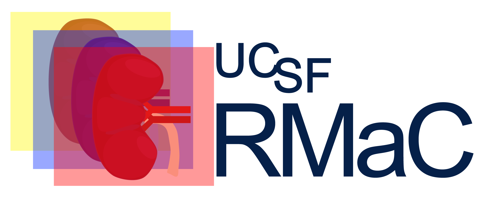

# UCSF RMaC: UCSF Renal Mass CT Dataset



This dataset provides a set of 831 3D Multiphase CT exams of renal masses from UCSF. Each exam includes an annotation of renal mass in the form of bounding boxes or polygon masks, and the pathology results from each renal mass that were obtained after surgery that serve as the ground-truth outcome.  The purpose of this dataset is to support development of new algorithms to better distinguish aggressive from indolent disease based on non-invasive imaging.

The CT volumes were acquired at UCSF between 2002-2018 and only renal masses less than or equal to 7cm (T1 stage) were included. Each exam has an unenhanced CT volume and up to three contrast enhanced CT phases (arterial/corticomedullary, portal venous/nephrogenic, delayed/excretory). For each exam, the contrast enhanced CT volumes are registered to the unenhanced volume. For a minority of the exams, registration was unsuccessful, but these exams are still included for further investigation.

## Citations


```
Larson, P., Wang, Z. J., Sahin, S., Diaz, E., Rajagopal, A., Abtahi, M., Jones, S., Dai, Q., Kramer, S.
UCSF RMaC: UCSF Renal Mass CT Dataset.
UCSF Center for Intelligent Imaging (Ci2) Datasets for Medical Imaging.
https://imagingdatasets.ucsf.edu/dataset/3.  doi: 10.58078/C2WC74 (2025).
```

```
Sahin SI. Quantification and Deep Learning Applications: Metabolite-Specific Hyperpolarized 13C-Pyruvate MRI and Multiphase CT in Renal Cell Carcinomas.
Order No. 31489175 ed. University of California, San Francisco; 2024.
https://www.proquest.com/dissertations-theses/quantification-deep-learning-applications/docview/3102832760/se-2
```

## Data Access (In Progress)

The dataset is hosted on AWS S3. It can be found at the following URIs:


The dataset can be downloaded directly by clickling on the following URLs:

https://imagingdatasets.ucsf.edu/dataset/3

https://registry.opendata.aws/ucsf-rmac/

Alternatively, the dataset can be downloaded via the AWS CLI:

1. Install [AWS CLI]("https://docs.aws.amazon.com/cli/latest/userguide/getting-started-install.html").
2. Copy using the S3 URI

```sh
aws s3 ls --no-sign-request s3://ucsf-rmac-dataset/
```

## File Structure of Dataset

All CT imaging data and associated metadata are organized in HDF5 container files named by patient ID (a 10 digit random alphanumeric code). A csv file is included as a key describing which phases are available for each subject and the registration status for each CT volume.

Within phase_reg_key.csv:

- 0 = no volume
- 1 = volume exists but is not registered to the unenhanced (noncon) volume
- 2 = volume exists and is registered to the unenhanced (noncon) volume

The file structure:

```sh
.
├── 08FBroxzI6.hdf5
├── 0A87Rq5Hkl.hdf5
├── 0ByGP3oWJi.hdf5
├── 0cb2z7Hao2.hdf5
...
├── phase_reg_key.csv
...
├── Zu1bNdA2od.hdf5
├── ZYUz7t5hOn.hdf5
└── Zz99Ji2swU.hdf5
```

Within a HDF5 container file, the CT volumes are organized as follows:

```sh
└── Zz99Ji2swU.hdf5
   ├── attrs
   ├── arterial
   ├── delay
   ├── mask
   ├── noncon
   └── portven
```

The attributes includes selected metadata and image labels.

The HDF5 files can be read in Python using the [H5py package](https://docs.h5py.org/en/latest/quick.html). For example, to print the containers and atrributes and extract the unenhanced (noncon) CT volume in a HDF5 file:

```python
import h5py
with h5py.File("Zz99Ji2swU.hdf5", "r") as hdf:
    print(f"HDF5 file datasets: {list(hdf.keys())}")
    print(f"HDF5 file attributes: {list(hdf.attrs.keys())}")
    noncon = hdf["noncon"][:]
    print(f"Shape of noncon volume: {noncon.shape}")
```

Output:

```sh
HDF5 file datasets: ['arterial', 'delay', 'mask', 'noncon', 'portven']
HDF5 file attributes: ['Manufacturer', 'PID', 'Patient Age', 'Patient Sex', 'arterial_pixdim', 'delay_pixdim', 'mask_pixdim', 'noncon_pixdim', 'pathology', 'pathology_grade', 'portven_pixdim', 'tumor_type']
Shape of noncon volume: (512, 512, 49)
```

## Tutorials

- [Label Exploration](tutorials/labelexploration.ipynb)
  - Explore the pathology labels across all the datasets and plot distributions

- [Tumor Mask Overlays](tutorials/maskoverlays.ipynb)
  - Visualize slices of the CT volumes and overlay tumor mask on

## Data Curation

Curation jupyter notebooks are collected in /curation and are numbered 01-07 to indicate each step of curation process.

A sample conda environment can be found in `environment.yml`

`curation/utils.py` -- contains utility functions for the curation steps

## Contributors

Project initiation and leadership - Peder Larson, PhD, and Zhen Jane Wang, MD

Dataset Extraction - Sage Kramer, MD

Curation - Sage Kramer, MD, Sule Sahin, PhD, Abhejit Rajagopal, PhD, Mansour Abtahi, PhD, Samantha Jones, Ernesto Diaz

Data Management - Sule Sahin, PhD, Abhejit Rajagopal, PhD, Ernesto Diaz, Qing Dai
